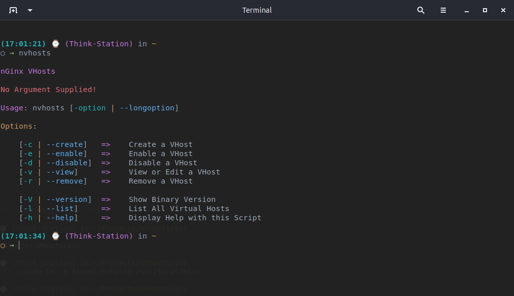
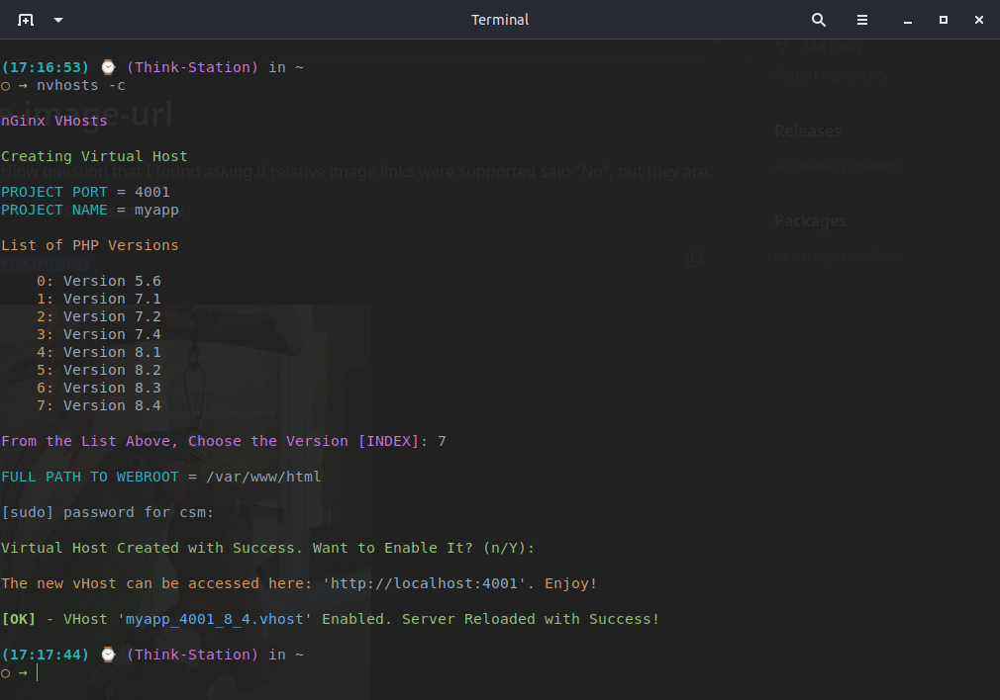
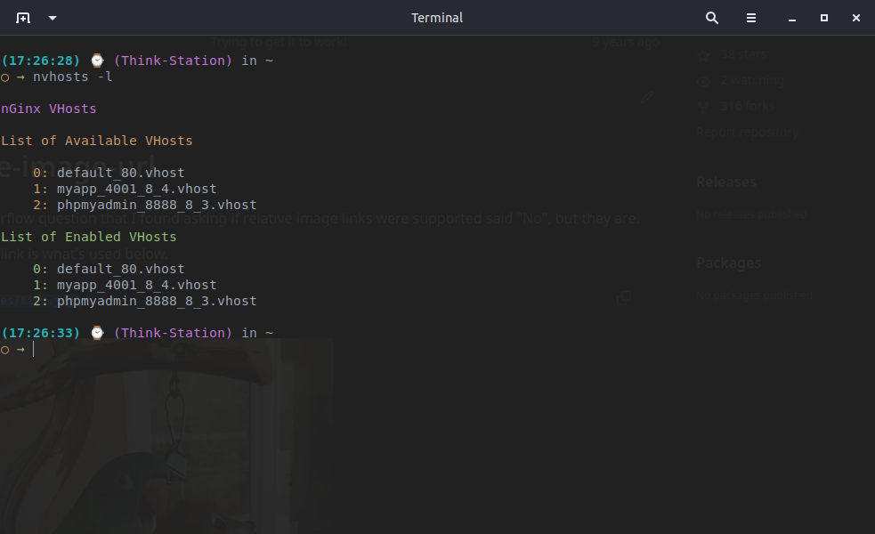

# nVHosts 0.4.1

This is a simple script to manage Virtual Hosts using nGinx and PHP on Linux machines.

### 1) Configuration 

    a) git clone https://github.com/lbassuncao/nVHosts.git
    b) cd nVHosts/src
    c) chmod +x nvhosts
    c) sudo ln -s $(pwd)/nvhosts /usr/local/bin/
    d) cd ..
    e) sudo ln -s $(pwd)/templates /usr/local/bin/
    f) restart your terminal

### 2) Test the Application

    a) nvhosts

### 3) Create a Virtual Host

    a) follow the examples bellow

### 3) Feel Free to Explore Other Options

