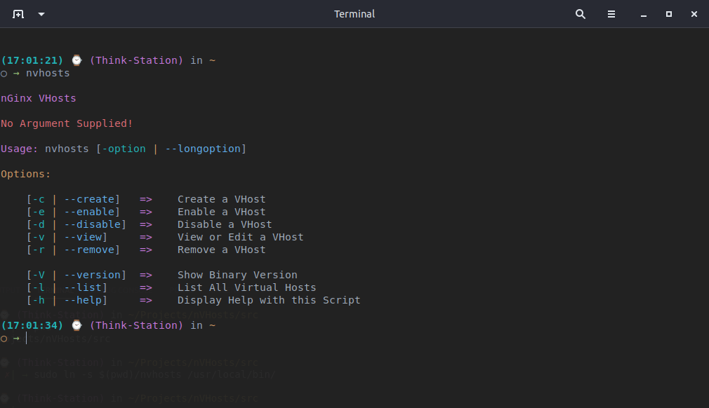
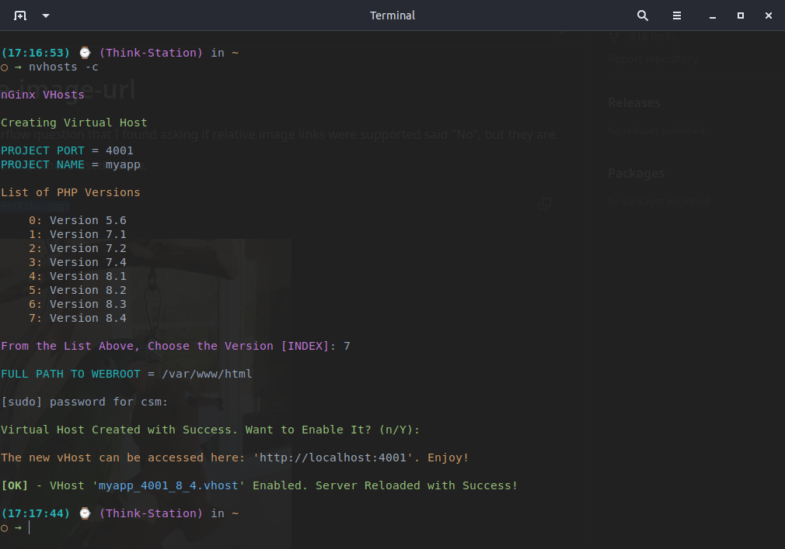
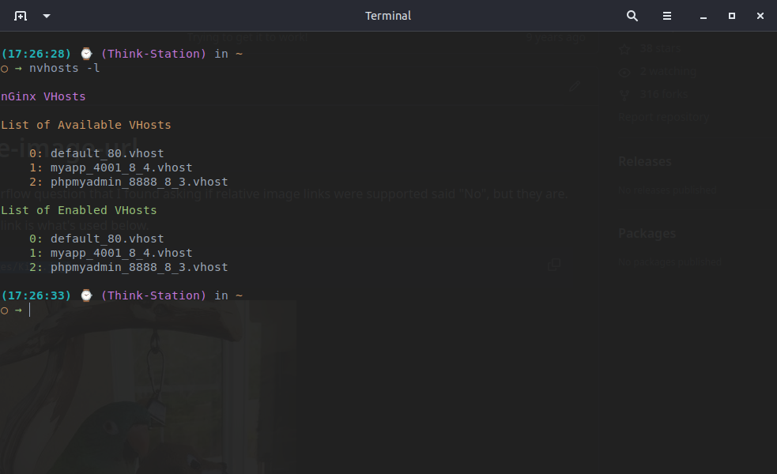

# nVHosts

[](LICENSE)
[](https://github.com/lbassuncao/nVHosts/actions/workflows/ci.yml)
[](https://www.gnu.org/software/bash/)

**Version:** 0.4.2  
**Author:** Luís Assunção

**nVHosts** is a powerful and lightweight CLI utility designed to simplify the management of **Nginx Virtual Hosts** and **PHP-FPM** environments on Linux machines. It streamlines the process of creating, enabling, disabling, and removing local development domains.

---

## 🚀 Features

*   **Fast Performance**: Optimized PHP version detection and file handling.
*   **Color-Coded Interface**: Semantic coloring (Errors in Red, Success in Green, Info in Blue) for better readability.
*   **Template Based**: Uses a customizable `default.conf` template for consistent server blocks.
*   **PHP Version Management**: Automatically detects installed PHP-FPM versions (e.g., 7.4, 8.0, 8.1) and configures the socket accordingly.
*   **Safety First**: Validates inputs, checks for port conflicts, and backs up operations with confirmation prompts.

---

## 🛠️ Installation

### Prerequisites
*   Linux OS (Debian/Ubuntu based recommended)
*   Nginx installed
*   PHP-FPM installed
*   Git & Bash

### Setup

1.  **Clone the Repository**
    ```bash
    git clone https://github.com/lbassuncao/nVHosts.git .nvhosts
    cd ~/.nvhosts
    ```

2.  **Make it Executable**
    ```bash
    chmod +x src/nvhosts
    ```

3.  **Install (Option A: Alias - Recommended)**
    To keep the folder structure intact (essential for the script to find the templates), add an alias to your shell configuration (`.bashrc` or `.zshrc`):
    ```bash
    # Replace /path/to/nVHosts with the actual path
    echo "alias nvhosts='$(pwd)/src/nvhosts'" >> ~/.bashrc
    source ~/.bashrc
    ```

    **Install (Option B: Symlink)**
    If you prefer symlinks, ensure you link both the binary and the templates so the relative paths work:
    ```bash
    # Link the executable
    sudo ln -s $(pwd)/src/nvhosts /usr/local/bin/nvhosts
    
    # Ensure the script can find the templates folder relative to itself
    # (The script looks for ../templates/default.conf)
    ```

---

## 📖 Usage

Run the script using the command `nvhosts` followed by an option.

```bash
nvhosts [option]
```

### Main Menu / List Hosts
Displays all available and enabled virtual hosts.
```bash
nvhosts -l
# or simply
nvhosts --list
```


### Creating a Virtual Host
Starts the interactive wizard to create a new host. You will be asked for:
1.  **Project Port** (Must be > 2000)
2.  **Project Name** (Alphanumeric, e.g., `myproject`)
3.  **PHP Version** (Select from detected versions)
4.  **Webroot Path** (Full path to your project, e.g., `/home/user/Dev/project/public`)

```bash
nvhosts -c
# or
nvhosts --create
```


### Managing Hosts (Enable/Disable/Remove)

*   **Enable a Host**: Creates a symlink from `sites-available` to `sites-enabled` and reloads Nginx.
    ```bash
    nvhosts -e
    ```
*   **Disable a Host**: Removes the symlink from `sites-enabled` and reloads Nginx.
    ```bash
    nvhosts -d
    ```
*   **Remove a Host**: Completely deletes the config files and associated logs (Safe delete with confirmation).
    ```bash
    nvhosts -r
    ```

### View or Edit
Open a Virtual Host configuration file in your preferred editor (vi, vim, nano, code, gedit).
```bash
nvhosts -v
```

---

## ⚡ Options Summary

| Short | Long | Description |
| :--- | :--- | :--- |
| `-c` | `--create` | Create a new Virtual Host |
| `-e` | `--enable` | Enable an existing Virtual Host |
| `-d` | `--disable` | Disable an active Virtual Host |
| `-v` | `--view` | View or Edit a Virtual Host config |
| `-r` | `--remove` | Remove a Virtual Host (Config & Logs) |
| `-l` | `--list` | List all Available and Enabled Hosts |
| `-V` | `--version` | Show current script version |
| `-h` | `--help` | Display the help menu |



---

## 📂 Project Structure

```text
nVHosts/
├── images/             # Screenshots
├── src/
│   └── nvhosts         # Main executable script
├── templates/
│   └── default.conf    # Nginx Server Block Template
├── LICENSE
└── README.md
```

## 📄 License

This project is licensed under the MIT License.
